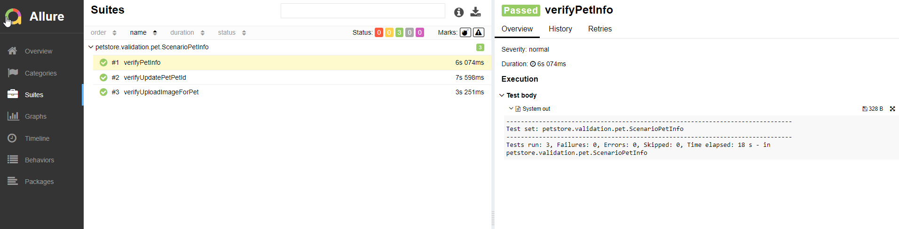
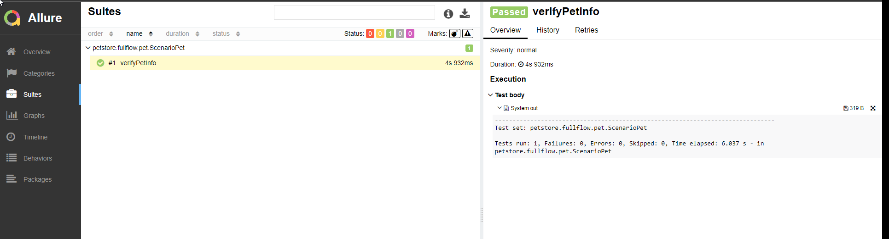

I) Library Used: depenpencies
1 )  rest assured

2) json -path
3) xml-path
4) gson
5) junit-jupiter
6) testng
7) allure-testng
8) maven surfire plugin

II) Report - local

+ mvn clean test -Dtest=ScenarioPetInfo
+ mvn clean test -Dtest=ScenarioPet
+ allure serve target/surefire-reports
  
+ 
